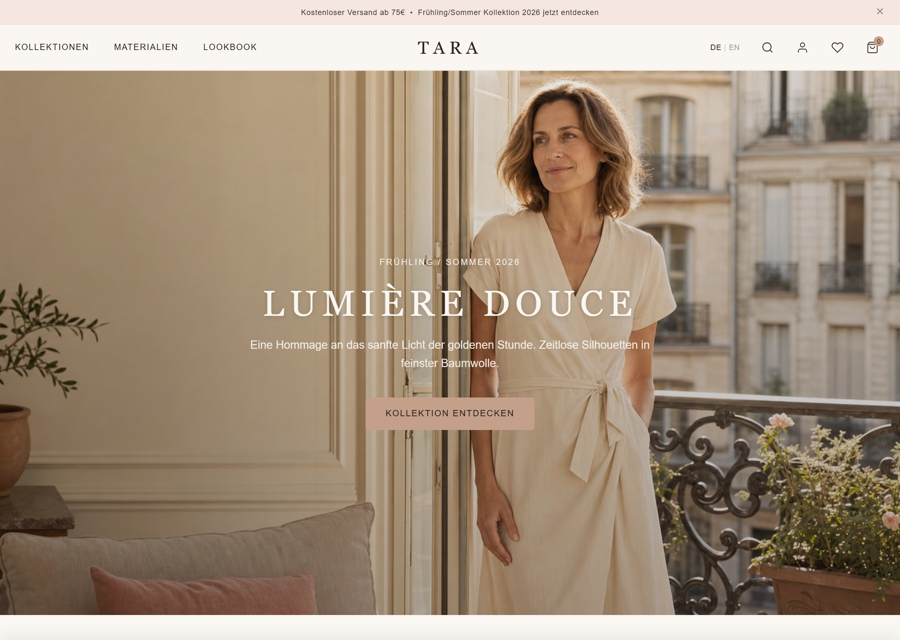
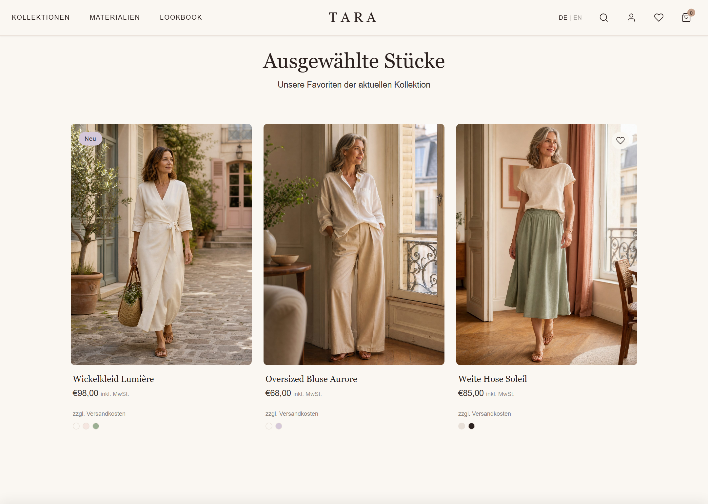
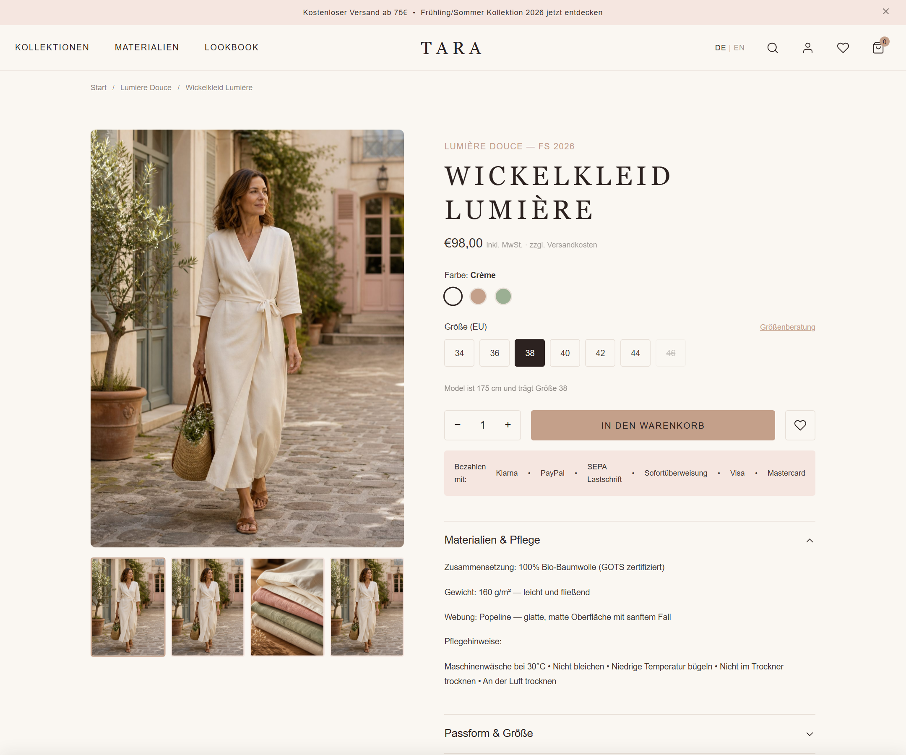
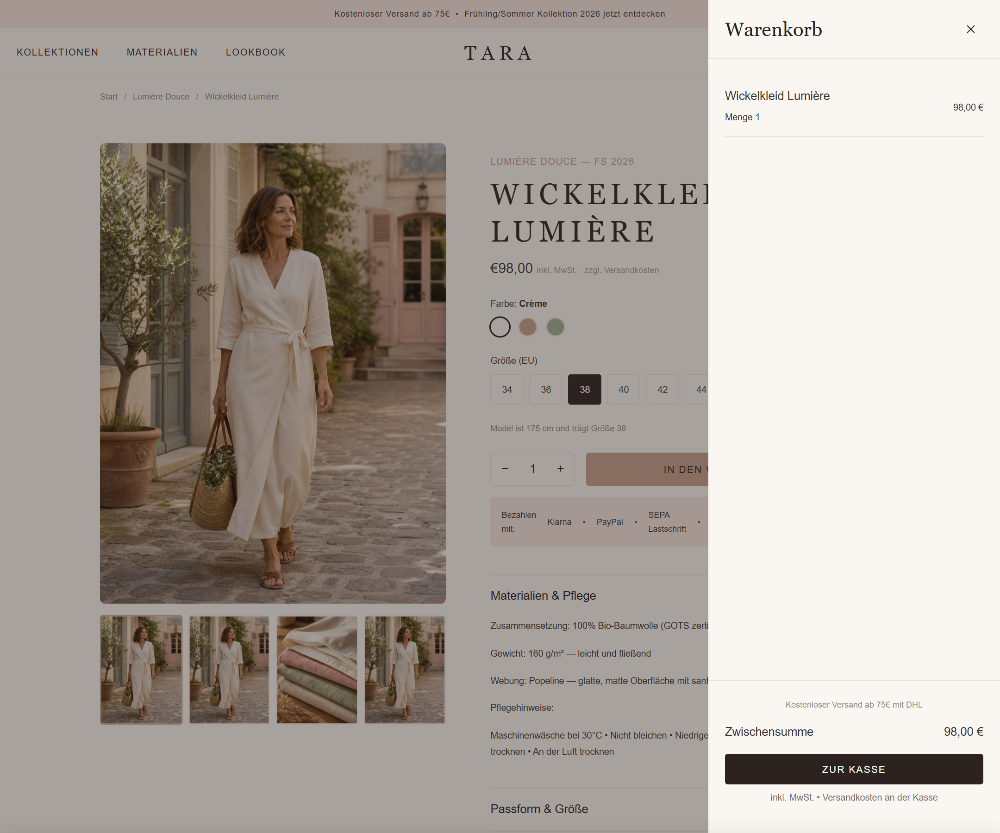
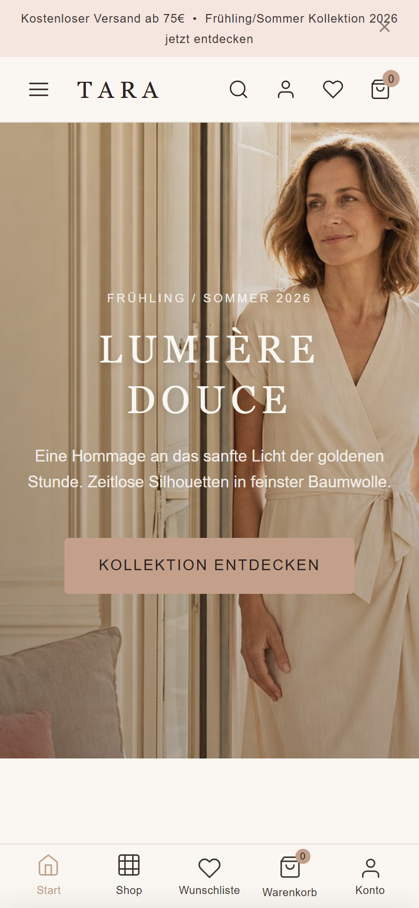

# TARA

> A frontend portfolio case study by Deepak: an editorial ecommerce prototype for a Germany-first cotton fashion brand.

[](https://www.11ty.dev/)


This repo is a portfolio case study for **TARA**, a fictional accessible-premium cotton clothing brand designed for women aged 35-55 in Germany. I built it to show how I think about **frontend execution, UX clarity, trust-building, and market-aware product decisions** when the goal is not just a pretty landing page, but a credible ecommerce experience.

**Built by:** Deepak (`deepakpk-dev`)  
**GitHub:** [deepakpk-dev](https://github.com/deepakpk-dev)  
**LinkedIn:** [deepakpk](https://www.linkedin.com/in/deepakpk/)  
**Contact:** [deepakp.tvla@gmail.com](mailto:deepakp.tvla@gmail.com)

## Live Demo

[View the live deployment](https://cotton-project-eta.vercel.app/)

## 30-Second Read

- I designed and built a multi-page fashion ecommerce prototype with **Eleventy, Nunjucks, vanilla JavaScript, and a token-based CSS system**.
- I treated the brief like a real market problem, not a gallery mockup: German legal surfaces, payment expectations, shipping cues, trust signals, readability for an older audience, and GDPR-aware interactions all shaped the interface.
- I used the project to demonstrate **decision-making**, especially where product strategy and frontend implementation meet.
- This is **production-minded**, but still clearly a **prototype**. The repo documents what is working today and what would need to change before launch.

## What I Owned

I owned the project end-to-end:

- Brand positioning and interface direction for a fictional Germany-first cotton label
- Research synthesis from ICP, competitor, and market documents into concrete UX choices
- Information architecture for homepage, collection, product, editorial, materials, size-guide, and legal flows
- Frontend implementation using reusable Eleventy templates, centralized data, CSS tokens, and vanilla JavaScript interactions
- Prototype realism details such as cookie consent, cart drawer behavior, wishlist persistence, shipping/tax copy, and German launch requirements

## Why This Is Strong Portfolio Material

- It shows I can move from **research and product framing** into an implemented interface.
- It demonstrates **taste with constraints**: premium editorial design, but still readable, trustworthy, and conversion-aware.
- It shows I think beyond happy-path UI by including legal, operational, and trust-building surfaces that matter in real ecommerce.
- It is structured as a maintainable static application rather than a one-off mockup.

## Recruiter Snapshot

| Area | Summary |
| --- | --- |
| Project Type | Frontend portfolio case study |
| Domain | Fashion ecommerce |
| Market | Germany-first, bilingual-ready |
| Stack | Eleventy 3, Nunjucks, vanilla JavaScript, CSS variables |
| What It Proves | Product judgment, UX systems thinking, frontend craft, implementation discipline |
| Prototype Scope | Editorial storefront, collection browsing, product detail flow, legal pages, consent, cart drawer, wishlist |

## My Key Decisions

- I positioned the brand as **French Soft Elegance** to create a distinct tone between minimal accessible premium and softer lifestyle storytelling.
- I optimized readability for **women aged 35-55**, which drove typography scale, spacing, restraint, and navigation clarity.
- I used a **cart drawer** instead of a hard cart page to preserve product context and reduce flow interruption.
- I chose a **mobile bottom-tab pattern** over a hamburger-heavy approach because primary shopping actions needed to remain visible.
- I treated sustainability as a **quiet trust signal** instead of headline activism to better match the audience and brand tone.
- I included German legal and trust surfaces because a credible Germany-first storefront needs them to feel real.

## Visual Walkthrough

### Desktop homepage



### Collection browsing



### Product detail flow



### Cart drawer interaction



### Mobile experience



## What The Prototype Includes

- Editorial homepage with capsule storytelling, product highlights, and trust cues
- Collection page with lookbook framing, merchandising, and sorting/filter UI
- Product detail page with shipping, returns, payments, fit, materials, and sustainability context
- German legal pages for `Impressum`, `Datenschutz`, `AGB`, and `Widerruf`
- Cookie consent banner with persisted preferences
- Wishlist and cart drawer state persisted in `localStorage`
- Bilingual-ready structure for German-primary commerce content

## Architecture

- **Eleventy + Nunjucks** for reusable layouts, includes, and generated pages
- **Centralized data files** for company, commerce, cookie, and product content
- **Token-based CSS** for consistent typography, spacing, color, and component styling
- **Vanilla JavaScript** for cart, wishlist, drawer behavior, and consent state
- **Static output** that can act as a prototype today and a migration reference for a later Shopify implementation

## Project Structure

```text
cotton-project/
├── website/
│   ├── src/                 # Eleventy templates, layouts, includes, and data
│   ├── css/                 # Design tokens and styling layers
│   ├── js/                  # Frontend interaction logic
│   └── images/tara/         # Local product and editorial imagery
├── docs/                    # Portfolio brief, QA notes, plans, and specs
├── assets/screenshots/      # Recruiter-facing screenshots
└── README.md
```

## Review This Repo Fast

If you only have a few minutes, review these files:

- [README.md](C:/Users/revat/OneDrive/Desktop/Agentic engineering/Cotton Project/README.md)
- [docs/TARA_Portfolio_Case_Study.md](C:/Users/revat/OneDrive/Desktop/Agentic engineering/Cotton Project/docs/TARA_Portfolio_Case_Study.md)
- [website/src/index.njk](C:/Users/revat/OneDrive/Desktop/Agentic engineering/Cotton Project/website/src/index.njk)
- [website/src/product.njk](C:/Users/revat/OneDrive/Desktop/Agentic engineering/Cotton Project/website/src/product.njk)
- [website/src/_data/site.js](C:/Users/revat/OneDrive/Desktop/Agentic engineering/Cotton Project/website/src/_data/site.js)

## Run Locally

```bash
cd website
npm install
npm run dev
```

Build the static site:

```bash
cd website
npm run build
```

The Eleventy dev server typically runs at `http://localhost:8080`.

## Prototype Boundaries

This repo is intentionally honest about scope:

- The legal identity and company fields are fictional prototype data
- The cart, wishlist, newsletter, and consent flows are frontend prototype behavior, not production integrations
- The storefront is static and not yet connected to Shopify, payments, fulfillment, or a live review system
- The project is meant to show **how I think and build**, while still documenting what real launch work remains

See:

- [docs/TARA_Portfolio_Case_Study.md](C:/Users/revat/OneDrive/Desktop/Agentic engineering/Cotton Project/docs/TARA_Portfolio_Case_Study.md)
- [docs/TARA_Launch_QA_Checklist.md](C:/Users/revat/OneDrive/Desktop/Agentic engineering/Cotton Project/docs/TARA_Launch_QA_Checklist.md)

## What I Would Do Next

- Convert the prototype into a Shopify theme implementation with real cart and checkout behavior
- Replace fictional legal/business identity data with reviewed production content
- Add deployment, Lighthouse evidence, and accessibility verification for the final hosted build
- Introduce real product data, localization workflows, and operational shipping/returns tooling
- Publish a short walkthrough video to make recruiter review even faster

## Supporting Research

- [TARA_Market_Research_Report.md](TARA_Market_Research_Report.md)
- [European_Women_ICP_Research.md](European_Women_ICP_Research.md)
- [European_Cotton_Brands_Research.md](European_Cotton_Brands_Research.md)
- [docs/TARA_Launch_QA_Checklist.md](docs/TARA_Launch_QA_Checklist.md)

## Contact

If you are hiring for **frontend engineering**, **product-minded UI work**, or **prototype-to-production ecommerce execution**, reach me at [deepakp.tvla@gmail.com](mailto:deepakp.tvla@gmail.com), [LinkedIn](https://www.linkedin.com/in/deepakpk/), or [GitHub](https://github.com/deepakpk-dev).
